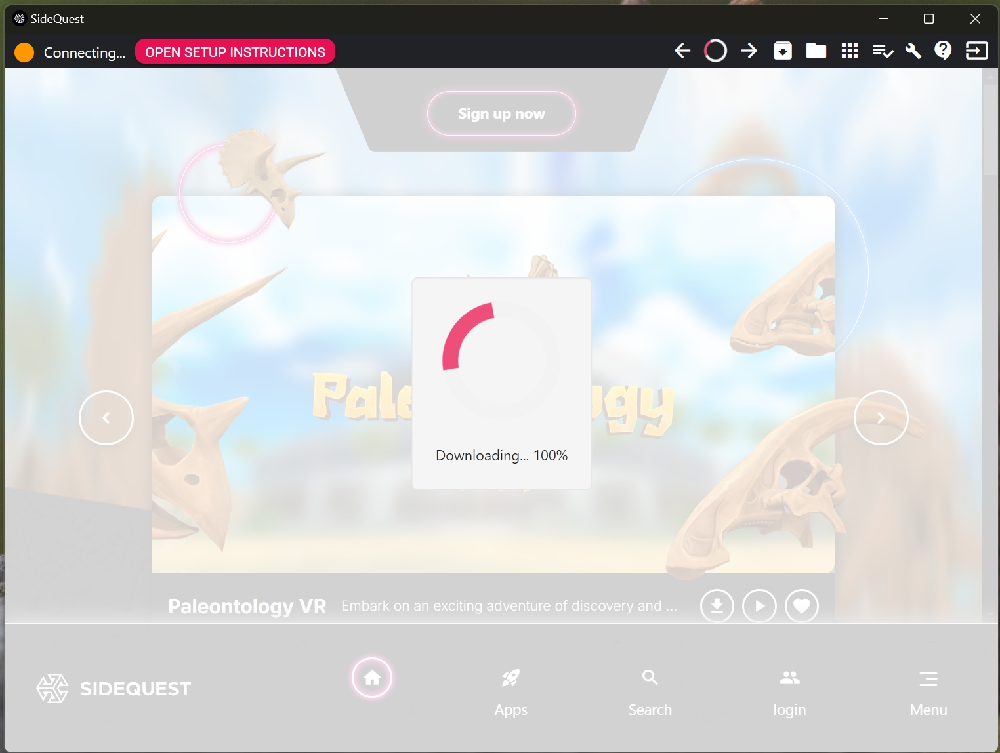
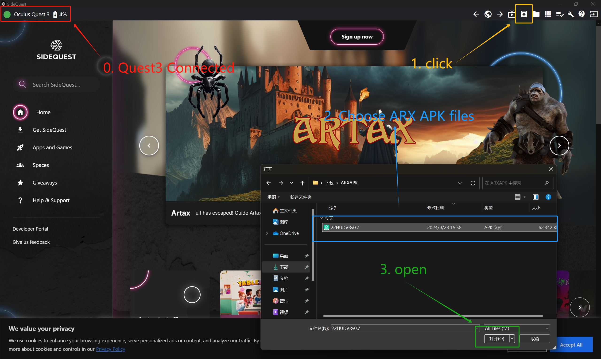
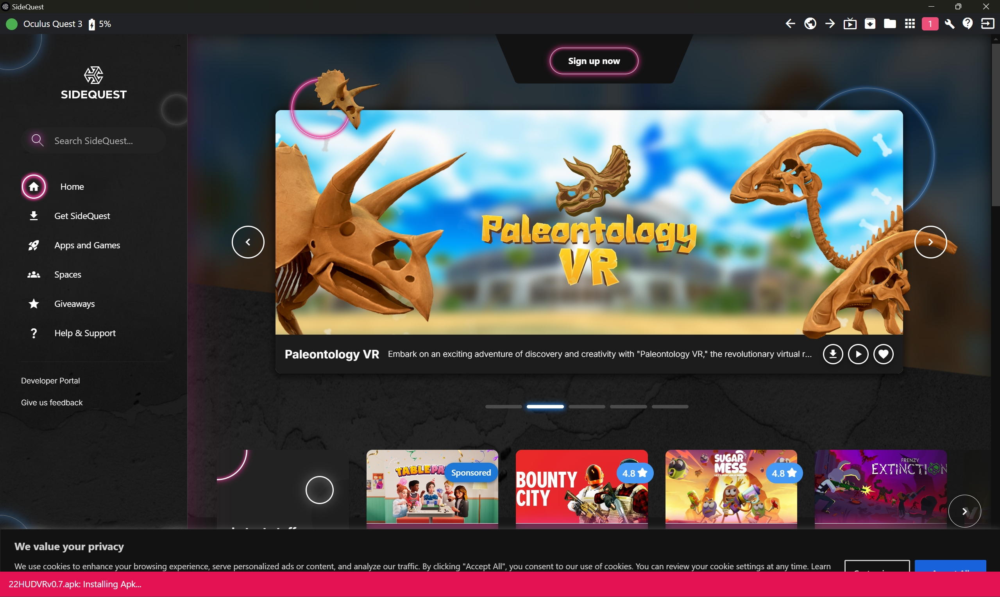

<h3 style="text-align: center;">ARX 方舟无限</h3>

  <a href="#注意：本文档仅供未配置Quest3的用户使用。">中文</a> | 
  <a href="#NOTE:-This-DOC-is-only-for-New-Quset3-Users.">English</a>

## NOTE: This DOC is only for New Quset3 Users.
### 0. Preliminary preparation
YOUR NEW QUEST3 ，Router ，Computer with Windows ，USB Type-C to USB Type-C Cable ，YOUR PHONE（Download Meta QUEST APP），YOUR EMAIL BOX ，ARX APK
### 1. Activate and update Quest3 , Enable developer mode
After connecting to Wi-Fi and completing the update, the main menu will appear.Then Enable developer mode

Official activation steps:
[Offical Tutorial](https://developers.meta.com/horizon/documentation/native/android/mobile-device-setup/)

### 2. Download QuestSides
open the website and download:
- Similarly, the official installation steps are also provided here:
  https://sidequestvr.com/setup-howto
  
- IF YOU WANT TO DOWNLOAD DIRRECTLY
  https://github.com/SideQuestVR/SideQuest/releases/download/v0.10.42/SideQuest-Setup-0.10.42-x64-win.exe
  
- Install SideQuset And Open it , Wait for updating download
  
  
- Connect the headset to the computer using a USB-C cable.
  On your headset the notification “USB Detected” will appear. Click on that notification to allow access.
  (Same to Quest 3 Allow USB Debugging notification)
  
- Prepare ARX APK files ，click SideQuest.
  
  
- wait 
  
  
- Success ! Congratulations, next step plz follow readme.md

  

## 注意：本文档仅供未配置Quest3的用户使用。
### 0. 准备工作
你的新Quest3，路由器，Windows电脑，USB Type-C到USB Type-C数据线，你的手机（需下载Meta Quest应用），你的邮箱，ARX APK文件。

### 1. 激活并更新Quest3，开启开发者模式

[官方教程](https://developers.meta.com/horizon/documentation/native/android/mobile-device-setup/)

### 2. 下载QuestSides
打开官网并下载：
- 同样，官方安装步骤也提供在这里：
  https://sidequestvr.com/setup-howto
- 如果你想直接下载：
  https://github.com/SideQuestVR/SideQuest/releases/download/v0.10.42/SideQuest-Setup-0.10.42-x64-win.exe
- 安装SideQuest并打开，等待更新完成。
  
- 使用USB-C线将头显连接到电脑。
  在头显上会出现“检测到USB”的通知。点击该通知以允许访问。
  （同样允许Quest 3的“USB调试”通知）
- 准备ARX APK文件，点击SideQuest。
  
- 等待
  
- 成功！恭喜，接下来的步骤请参考readme.md。

