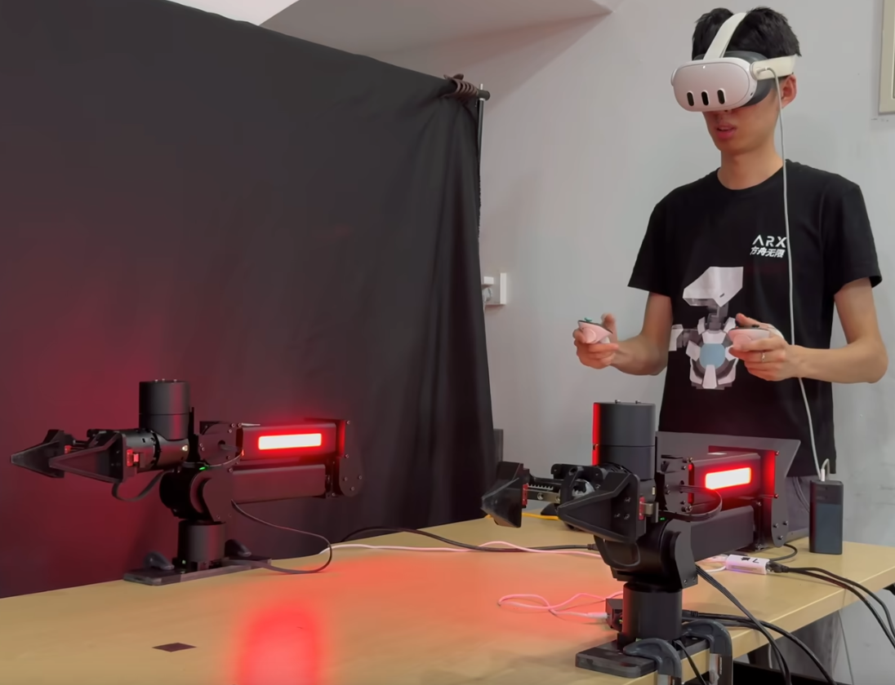

<h1 style="text-align: center;">VR Remote OpenSource</h1>


<h3 style="text-align: center;">ARX 方舟无限</h3>

<p style="text-align: center;">
  <a href="Readme_zh-cn.md">中文</a> | 
  <a href="Readme_en.md">English</a>
</p>
<hr style="text-align: center;">
<h2 style="text-align: ">🎥 效果演示</h2>


<p style="text-align: center;">
  <a href="https://www.bilibili.com/video/BV1kw4m1e7Y2/?share_source=copy_web&vd_source=c6612aeddf2edca621e06e14a69fdf50" target="_blank">
  </a>
</p>
<p align="center">
  <a href="https://www.bilibili.com/video/BV1kw4m1e7Y2/?share_source=copy_web&vd_source=c6612aeddf2edca621e06e14a69fdf50" target="_blank">
    
  </a>
</p>
## ℹ️ 说明

仓库用于构建 Meta Quest3/Quest3s 和 方舟无限(ARX) 产品 空间位置信息的通讯桥梁 
以下是仓库支持的产品型号

<table style="width: 100%; text-align: center; border-collapse: collapse;">
  <thead>
    <tr>
      <th>🦾 产品型号</th>
      <th>🔗 仓库连接</th>
    </tr>
  </thead>
  <tbody>
    <tr>
      <td>ARX_X5 机械臂</td>
      <td><a href="#">https://github.com/ARXroboticsX/ARX_X5</a></td>
    </tr>
    <tr>
      <td>ARX_R5系列 机械臂</td>
      <td><a href="#">https://github.com/ARXroboticsX/R5</a></td>
    </tr>
    <tr>
      <td>ARX_LIFT 采集平台</td>
      <td><a href="#">https://github.com/ARXroboticsX/LIFT</a></td>
    </tr>
    <tr>
      <td>ARX_X7系列</td>
      <td><a href="#">https://github.com/ARXroboticsX/X7s</a></td>
    </tr>
  </tbody>
</table>
硬件连接参考 

---


##  1.🖥️测试环境

Ubuntu 20.04  ROS Noetic(AMD64 ARM64)
Ubuntu 22.04 ROS Humble(AMD64)
⚠️ **注意:** 其他操作系统需要进行额外配置

### 1.1**📝** VR前期准备

如果您不熟悉Quest3或者没有使用过VR系列产品，可以参考简略的[认识Quest3教程](熟悉Quest3.md)，如果可以的话推荐[Meta的官方教程](https://www.meta.com/help/quest/1994971530885728/?srsltid=AfmBOopU0puvld0dVfJEg2WYxiXC7Sr_6s5OVvPvYB0qFBsDN2HcEyxA).

您需要通过SideQuest 向您的Meta Quest中安装APK，具体安装操作步骤可以参考[Quest3 APK 安装教程](Quest3_APK_Install.md)

### 1.2 📝 电脑/NUC前期准备

安装好测试环境中的系统 并 下载 产品型号对应的代码，以ARX_LIFT 采集平台ROS1为例
打开终端

```bash
git clone https://github.com/ARXroboticsX/LIFT.git
# 进入ARX_VR_SDK
cd ARX_VR_SDK/ROS
# 运行port.sh进行运行库安装
sudo ./port.sh
```

---

## 2.🟢启动VR 

### 2.1❗ 注意事项

1. 所有人员应保持与机械臂的安全距离，以避免任何潜在的风险！
2. 在执行实机VR遥操作机械臂前，请确保仔细阅读操作说明。
3. 操作机械臂前，请确保已经及时的复位0点和Meta视角，避免潜在的误操作问题。

### 2.2 🕹️VR端操作

请在确保正确的硬件连接后，允许USB进行调试

[如何通过X5_MR_Control操作机械臂（软件端）](VR软件操作.md)

### 2.3🖱️电脑NUC操作

```bash
# 进入ARX_VR_SDK
cd ARX_VR_SDK/ROS
# 运行port.sh进行运行库安装
sudo ./ARX_VR.sh
# 按照操作手册中的说明进行操作 同时 在话题中查看VR输出数据
source install/setup.bash && ros2 topic echo /ARX_VR_L
source install/setup.bash && ros2 topic echo /ARX_VR_R
```

 ### 2.4 🚪退出

长按Meta和A/X按键完成复位，关闭VR应用程序，关闭电脑端程序

# 3.📦硬件清单

由于不同国家或地区，链接仅供参考

<table style="width: 100%; text-align: center; border-collapse: collapse;">
  <thead>
    <tr>
      <th>名称</th>
      <th>数量</th>
      <th>链接</th>
      <th>备注</th>
    </tr>
  </thead>
  <tbody>
    <tr>
      <td>ARX机械臂系列</td>
      <td>1</td>
      <td><a href="https://arx-x.com/">官网</a></td>
      <td>X5,R5,LIFT,X7S系列</td>
    </tr>
    <tr>
      <td>Meta Quest3</td>
      <td>1</td>
      <td><a href="https://www.amazon.com/Meta-Quest-128GB-Breakthrough-Reality-3/dp/B0C8VKH1ZH">Amazon</a></td>
      <td>需要开发者模式安装APK</td>
    </tr>
	<tr>
       <td>电脑/NUC</td>
       <td>1</td>
       <td></td>
       <td>ubuntu20或ubuntu22系统</td>
    </tr>
    <tr>
       <td>串口盒子</td>
       <td>1</td>
       <td></td>
       <td>支持TYPEC串口即可</td>
    </tr>
	<tr>
       <td>双头TYPEC数据线</td>
       <td>2</td>
       <td><a href="https://detail.tmall.com/item.htm?id=601375235325&pisk=gQsT_lYut4v696I9KOznornIRPwHXyXNL1WSmIAil6CdMTHGSEADlnCPwEi07hYvD6OhjCXMfKTfi__M1NAmDiCF6cmDfsqvGT7U3CvGjxpfR1ncSOAGJxKNxNmDs5-Ah_xYZ7quqOWwYnNuZqOu5E-WeIisidTBAnvA-OgiFOWw0IMnGzbCQxKtegkXhIwpAKp-5nT6CeGBTKvsGsO6RX9JUntfGFMBdL9m5d9X1vwpeK9sfc96RB9k3Kg1GnwddBJXcd1XcxvYBBk6BmQyaYmJWzBscmspBealCB6Vn-vBWZB997N5vg89NOOKc7z5C2d6FgNn7LLOMeshnYmDTO_PgL1s17YNhwCpB6VEJpQl_gKCVWoAMTSF9p17D0A1LTbk7GamqUKp6Ej1B5EkJObfDaW3u4XeyabWJirrbOLyOhj6Vul6iwXRDKI4gkCRUM5pd_ZxmIjN6G-GA8gpiaJf4VIl24RsZQpm5JeKuq86LkeNnjxTMdRepQ265qu2opJpZJFIuq8pZpduCI3queih.&pvid=f368dda4-ccb0-462d-93d5-b4ad297fd544&scm=1007.56608.416674.0&skuId=5902303315322&spm=tbpc.boughtlist.repurchaseitem.d1.274c2e8dSONtf4&xxc=home_recommend">TaoBao</a></td>
       <td>TYPEC数据线</td>
    </tr>
  </tbody>
</table>


# 4 🤝鸣谢

**[SideQuest](https://github.com/SideQuestVR/SideQuest)**：https://github.com/SideQuestVR/SideQuest

Meta XR All-in-One SDK：https://assetstore.unity.com/packages/tools/integration/meta-xr-all-in-one-sdk

