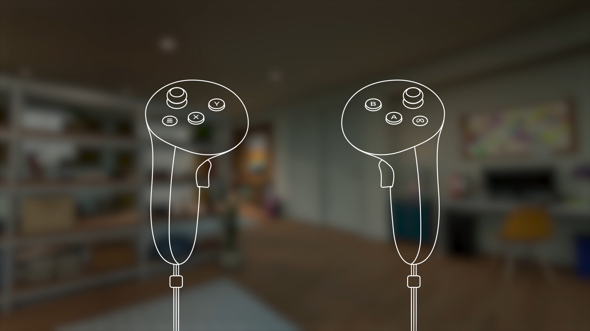
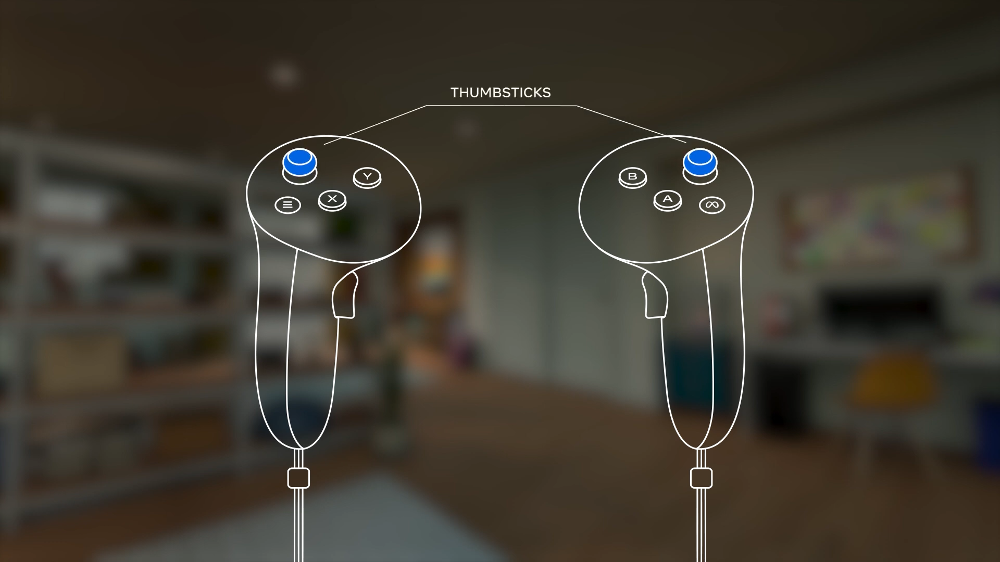
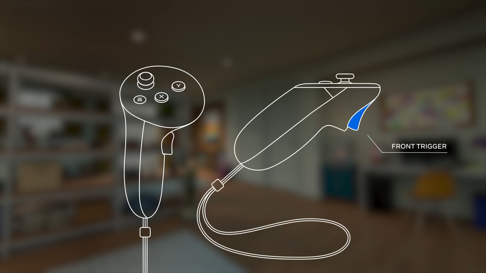
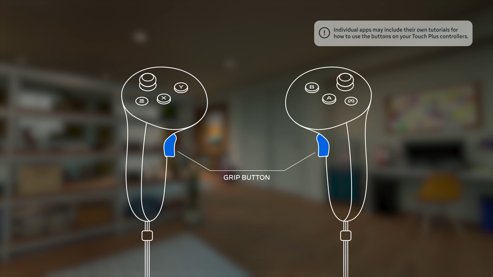
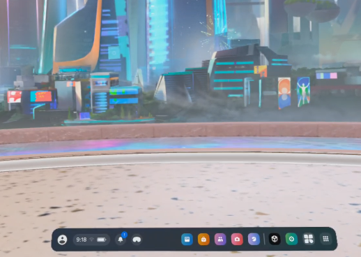
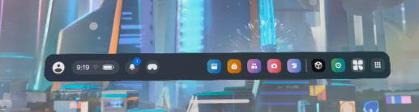
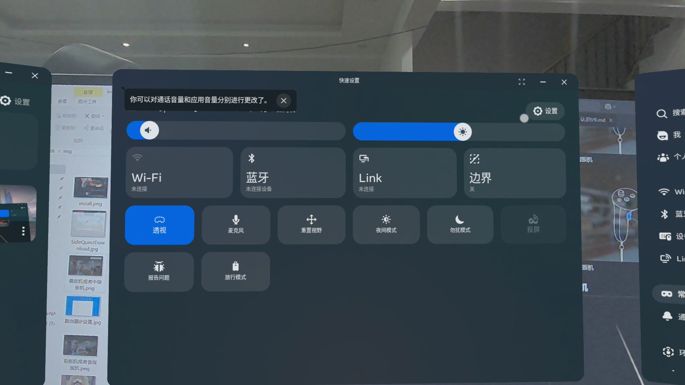
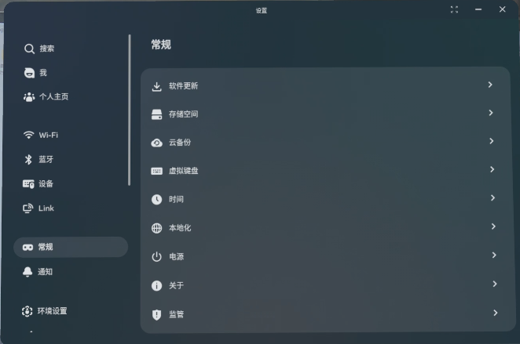
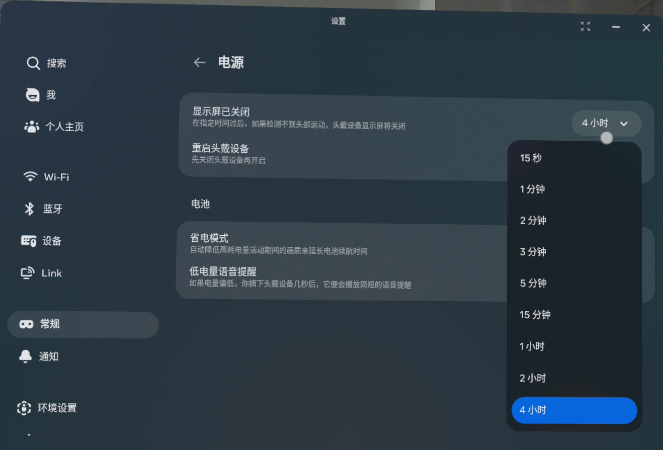

## 打开包装

包装盒打开后如下

分别是左右手柄头显 TypeC线和充电适配器

## 认识头显按钮

LED指示灯

电源按钮长按5秒开机

音量按钮（上）和透视切换按钮（下）
## 认识手柄

左手柄 和 右手柄

meta按键

左摇杆和右摇杆

食指扳机

侧方扳机
## 开机
电源按钮长按5秒开机

开机后头显画面如图所示，可以按下透视切换按钮切换透视

拿起左右手手柄，请确保左右手柄电池均有电，可以正确在视野中观察到

左侧从左至右 菜单栏 账户 菜单栏 消息 透视切换
右侧从右至左 应用列表 MTP（无作用）设置 X5_MR_Control

用食指扳机选择并进入X5_MR_Control(左右手均可)

如果你找不到菜单或者菜单栏不存在，请按右手meta键

## 延长息屏时间
如果长时间无操作 quest将试图进入休眠 
以下是将休眠时间调整为四小时的教程

打开菜单 选择 设置

选择  常规 - 电源

显示屏已关闭 - 4小时

